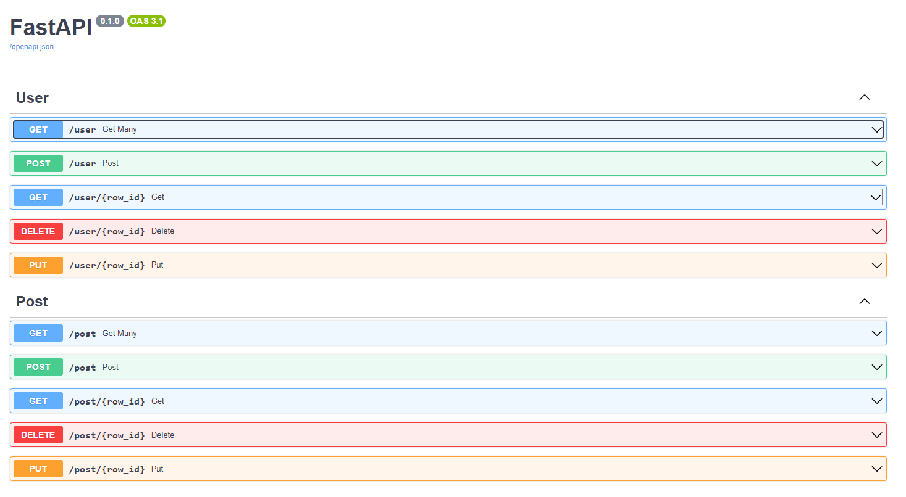
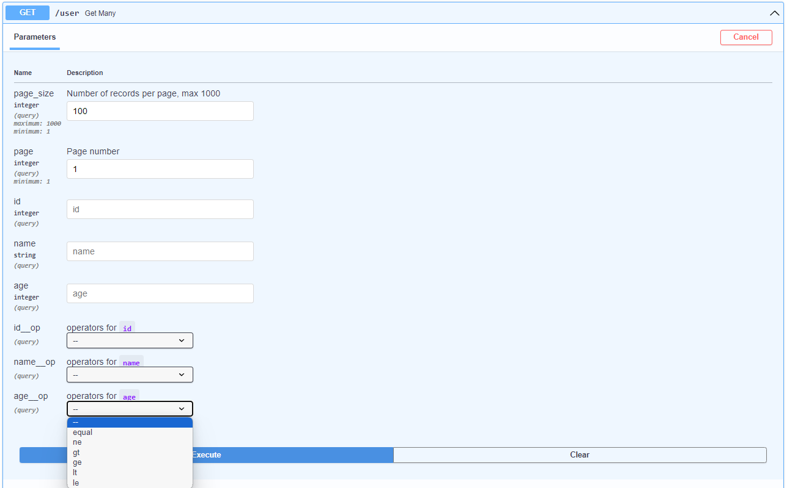
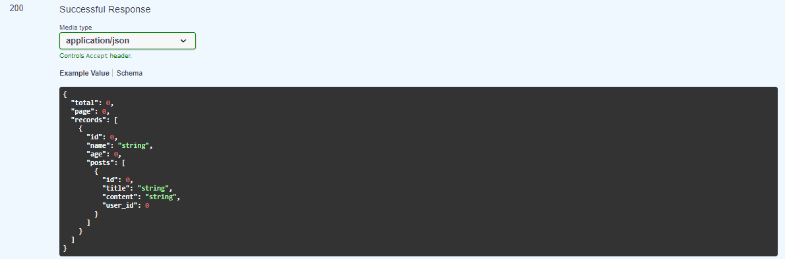
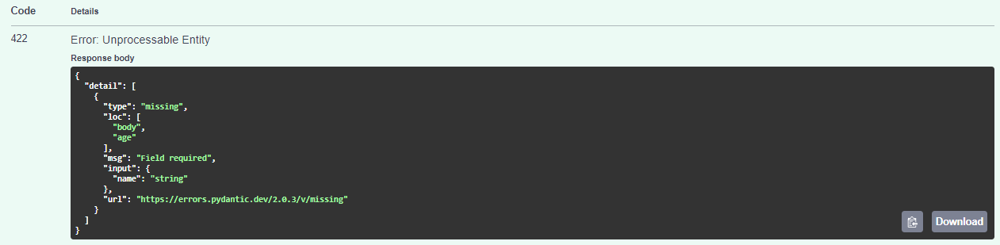

<p align="center">
  <a></a>
</p>

<p align="center">
  <a href="https://github.com/nacosdev/sqlalchemy_api/actions?query=workflow%3ATests+event%3Apush+branch%3Amain" target="_blank">
      
  </a>
  <a href="https://coverage-badge.samuelcolvin.workers.dev/redirect/nacosdev/sqlalchemy_api" target="_blank">
      
  </a>
  <a href="https://pypi.org/project/sqlalchemy-api" target="_blank">
      
  </a>
  <a href="https://pypi.org/project/sqlalchemy-api" target="_blank">
      
  </a>
</p>

SQLAlchemy API is a library that helps to turn the [SQLAlchemy](https://www.sqlalchemy.org/) models into a REST API. It uses the power of [Pydantic 2](https://docs.pydantic.dev/dev-v2/), to validate and serialize the data. This is a framework-agnostic library that can be used with any web framework. Currently, it provides support for [Starlette](https://www.starlette.io/) and [FastAPI](https://fastapi.tiangolo.com/).

---
**Documentation**: <a href="https://github.com/nacosdev/sqlalchemy_api" target="_blank">https://github.com/nacosdev/sqlalchemy_api</a>
---

**Table of Contents**

- [Requirements](#requirements)
- [Installation](#installation)
- [License](#license)

---

## Requirements

- Python>=3.7
- SQLAlchemy>=1.4
- Pydantic>=2

## Installation

```bash
pip install sqlalchemy-api
```

## Example

### Create it

- Create a file `main.py` with SQLAlchemy models and mount the crud using one of the adapters, in this example we will use the FastAPI adapter:

```python
from sqlalchemy_api.adapters.fastapi_crud import APICrud
from sqlalchemy import Column, Integer, String, create_engine, ForeignKey
from sqlalchemy.orm import relationship
from sqlalchemy.ext.declarative import declarative_base
from fastapi import FastAPI

Base = declarative_base()

engine = create_engine(
    "sqlite:///example.db",
    connect_args={"check_same_thread": False},
)

class User(Base):
    __tablename__ = "user"
    id = Column(Integer, primary_key=True)
    name = Column(String(50), default="John Doe")
    age = Column(Integer, nullable=False)
    posts = relationship("Post", back_populates="user")

class Post(Base):
    __tablename__ = "post"
    id = Column(Integer, primary_key=True)
    title = Column(String)
    content = Column(String)
    user_id = Column(Integer, ForeignKey("user.id"), nullable=False)
    user = relationship("User", back_populates="posts")

Base.metadata.create_all(engine)  # Create tables

user_crud_router = APICrud(User, engine)
post_crud_router = APICrud(Post, engine)

app = FastAPI()
app.include_router(user_crud_router, prefix="/user", tags=["User"])
app.include_router(post_crud_router, prefix="/post", tags=["Post"])
```

You will also need an ASGI server and FastAPI to be able to run this app, both are optional dependencies of SQLAlchemy API:

```bash
pip install sqlalchemy-api[fastapi]
```

### Run it
```bash
uvicorn main:app --reload
```


### Use it
Endpoints are automatically generated for the defined models and the FastAPI adapter provides automatic Swagger documentation, you can access [localhost:8000/docs](localhost:8000/docs) to interact with them:

<p align="center">
  <a></a>
</p>

SQLAlchemyAPI also provides different operators depending on the column data type, to filter the data:

<p align="center">
  <a></a>
</p>

The data returned is automatically paginated and serialized, including the relationships defined in the models:

<p align="center">
  <a></a>
</p>

Post data is automatically validated and serialized using Pydantic, for example, if you try to create a user wihout the required `age` field, you will get an error like this:

<p align="center">
  <a></a>
</p>

## License

`sqlalchemy-api` is distributed under the terms of the [MIT](https://spdx.org/licenses/MIT.html) license.


